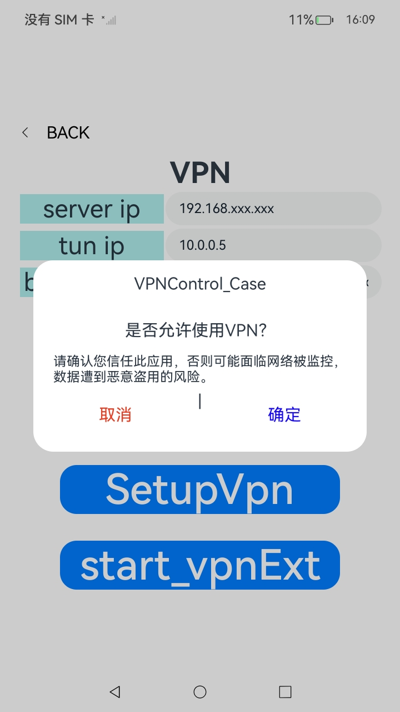
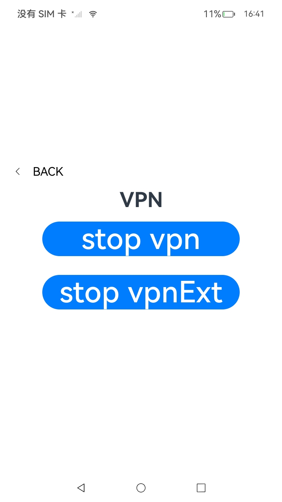
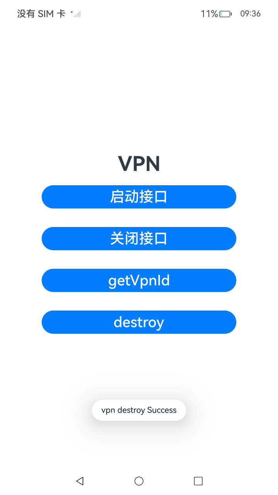
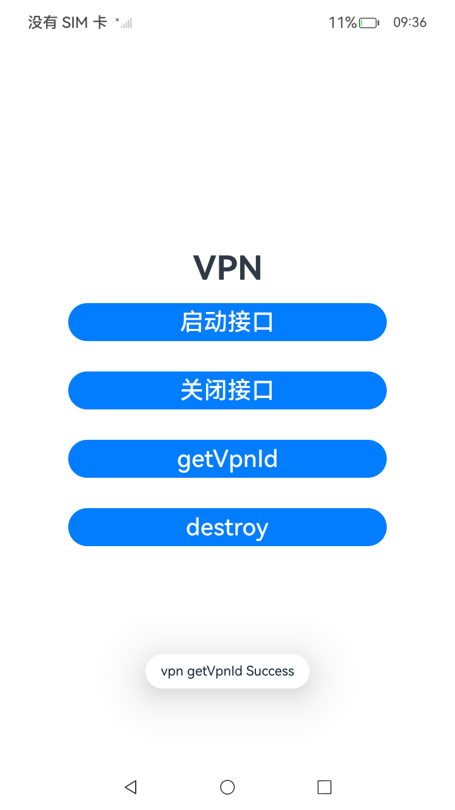

# VPN 应用

### 介绍

VPN 即虚拟专网（VPN-Virtual Private Network）在公用网络上建立专用网络的技术。整个 VPN 网络的任意两个节点之间的连接并没有传统专网所需的端到端的物理链路，而是架构在公用网络服务商所提供的网络平台（如 Internet）之上的逻辑网络，用户数据在逻辑链路中传输。本项目展示了一个管理的示例应用，它实现了通过按钮实现建立VPN 网络隧道、保护建立的 UDP 隧道以及建立一个 VPN 网络等功能，使用了[@ohos.net.vpn](https://gitcode.com/openharmony/docs/blob/master/zh-cn/application-dev/reference/apis-network-kit/js-apis-net-vpn.md)、[@ohos.net.vpnExtension](https://gitcode.com/openharmony/docs/blob/master/zh-cn/application-dev/reference/apis-network-kit/js-apis-net-vpnExtension.md)和[@ohos.app.ability.VpnExtensionAbility](https://gitcode.com/openharmony/docs/blob/master/zh-cn/application-dev/reference/apis-network-kit/js-apis-VpnExtensionAbility.md)接口。

### 效果预览

| 程序启动                            | 创建隧道                                | 启动vpnExt                             | 关闭VPN                             | 生成VPN Id                                                 | 断开VPN                                                     |
| ----------------------------------- | --------------------------------------- | -------------------------------------- | ----------------------------------- |----------------------------------------------------------|-----------------------------------------------------------|
|  |  |  |  |  |  |

使用说明

备注：需在 `entry\src\main\module.json5` 文件的 `extensionAbilities` 节点下，为 `type` 字段手动新增 `vpn` 选项。

1. 在设备上启动应用。

2. 在界面上输入 VPN 服务器 IP 地址、虚拟网卡 IP 地址和需要阻止的应用包名。（也可以使用默认数据作为选项）

3. 点击 `创建隧道` 按钮以建立 UDP 隧道。

4. 点击 `保护隧道` 按钮以将隧道与虚拟网卡绑定。

5. 点击启动VPN拓展程序启动VPN拓展能力。

6. 点击 `启动VPN` 按钮配置 VPN 并启动 VPN 服务。

7. 点击 `关闭VPN` 按钮以停止 VPN 连接。

8. 点击 `关闭VPN拓展程序` 按钮以停止 VPN 扩展能力。

9. 点击 `getVpnId` 按钮，生成VPN Id。
 
10. 点击 `destroy` 按钮,可断开VPN。

### 工程目录

```
entry/src/main/ets/
|---entryability
|   |---EntryAbility.ets            // 请求相关权限
|---notification
|   |---NotificationContentUtil.ets			// 初始化通知内容，提供基本通知内容创建功能
|   |---NotificationManagementUtil.ets			// 管理通知，包括分类、统计、取消和设置角标
|   |---NotificationOperations.ets			// 操作通知，支持发布可点击跳转的通知
|   |---NotificationRequestUtil.ets			// 创建通知请求，支持基本和 WantAgent 类型的通知请求
|   |---NotificationUtil.ets			// 提供通知发布、取消等功能，管理通知状态
|   |---WantAgentUtil.ets			// 创建 WantAgent，用于启动能力或发送通用事件
|---pages
|   |---Index.ets                  // 首页
|   |---SetupVpn.ets               // 设置vpn
|   |---StartVpn.ets               // 打开vpn
|   |---StopVpn.ets                // 关闭vpn
|---vpnability
|   |---DestroyVpnTest.ets         // 断开VPN
|   |---GetVpnIdTest.ets           // 生成VPN Id
|   |---VPNExtentionAbility.ets    // VPN扩展能力
|---model
|   |---Logger.ets                 // 日志
|   |---ShowToast.ets              // 输出气泡
|   |---component.ets              // 标题栏组件
|       |---CommonConstant.ets     // 字符串常量
|---serviceextability
|   |---MyVpnExtAbility.ts         // 三方vpn能力

entry/src/main/cpp/
|---types
|   |---libentry
|   |   |---index.d.ts             // C++ 导出接口
|---napi_init.cpp                  // 业务底层实现
```

### 具体实现

1. 创建 VPN 隧道

   - 创建 VPN 隧道的过程是通过 UDP 隧道与指定的 VPN 服务器建立连接。该过程是通过调用 `vpn_client.udpConnect()` 方法实现的，传入目标服务器的 IP 地址和端口号进行连接。成功连接后，可以使用该隧道进行数据传输。
     - 通过 `vpn_client.udpConnect()` 函数与指定的 VPN 服务器建立 UDP 隧道。
     - 如果连接成功，调用 `showToast()` 弹出成功提示，并记录日志。
     - 如果连接失败，弹出失败提示，并记录错误日志。

2. 保护 VPN 连接

   - VPN 连接需要通过保护措施来确保数据安全性。`VpnConnection.protect()` 方法用于为已建立的隧道创建保护，防止数据泄漏。
     - 使用 `VpnConnection.protect()` 方法为 VPN 隧道添加保护。
     - 如果保护成功，显示成功提示并记录日志。
     - 如果保护失败，显示失败提示，并记录错误信息。

3. 启动 VPN 连接

   - 启动 VPN 连接涉及创建一个 VPN 配置并启用连接。我们通过 `VpnConnection.create()` 创建配置，并通过 `vpn_client.startVpn()` 启动 VPN 服务。
     - 创建一个 `Config` 对象，配置包括虚拟网卡的 IP 地址、MTU 大小、DNS 地址等。
     - 调用 `VpnConnection.create()` 来建立 VPN 配置。
     - 调用 `vpn_client.startVpn()` 启动 VPN 服务。

4. 停止 VPN 连接

   - 停止 VPN 连接的实现通过 `vpn_client.stopVpn()` 停止当前的 VPN 隧道连接，并清理相关资源。
       - 使用 `vpn_client.stopVpn()` 停止 VPN 连接。
       - 调用 `VpnConnection.destroy()` 销毁 VPN 连接对象。
       - 销毁操作成功后，弹出成功提示；失败则弹出错误信息。

5. 扩展 VPN 功能

   - 通过 `vpnext.startVpnExtensionAbility()` 和 `vpnext.stopVpnExtensionAbility()` 方法，可以启动和停止 VPN 扩展能力，实现自定义的 VPN 功能。
       - 调用 `vpnext.startVpnExtensionAbility()` 启动自定义 VPN 扩展功能。
       - 启动成功后，显示提示并记录日志。
       - 启动失败时，显示错误信息并记录日志。

6. 获取VPN ID

    - 通过 `vpnConnection.generateVpnId()` 方法，可以获取VPN的ID。
        - 获取成功后，显示提示并记录日志。
        - 获取失败时，显示错误信息并记录日志。

7. 断开VPN

    - 通过 `vpnConnection.destroy()` 方法，可以断开VPN的连接。
        - 断开连接成功后，显示提示并记录日志。
        - 断开连接获取失败时，显示错误信息并记录日志。

### 相关权限

[ohos.permission.INTERNET](https://gitcode.com/openharmony/docs/blob/master/zh-cn/application-dev/security/AccessToken/permissions-for-all.md#ohospermissioninternet)

### 依赖

不涉及。

### 约束与限制

1. 本示例仅支持标准系统上运行，支持设备：RK3568。
2. 本示例为Stage模型，支持API20版本SDK，版本号：6.0.2。
3. 本示例需要使用DevEco Studio Release（5.0.5.306）及以上版本才可编译运行。

### 下载

如需单独下载本工程，执行如下命令：

``` 
git init
git config core.sparsecheckout true
echo code/DocsSample/NetWork_Kit/NetWorkKit_NetManager/VPNControl_Case/ > .git/info/sparse-checkout
git remote add origin https://gitcode.com/openharmony/applications_app_samples.git
git pull origin master
```